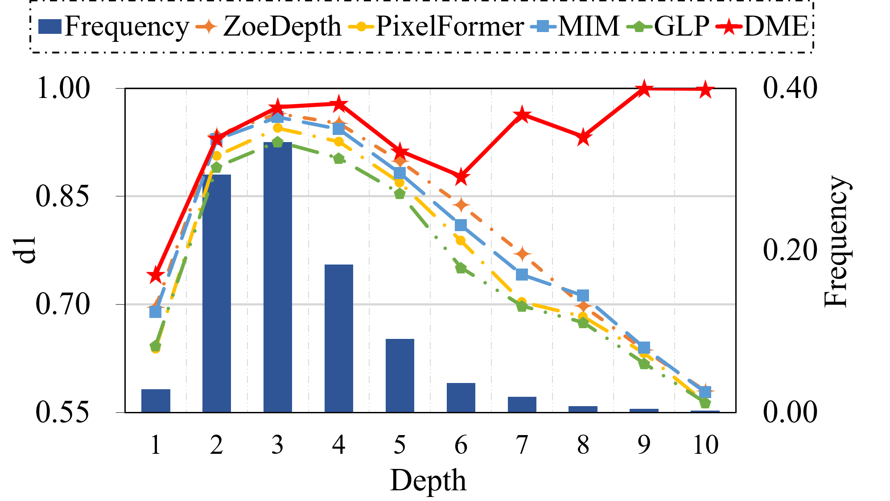

# 于松松

### Master Student @[Dalian University of Technology](https://www.dlut.edu.cn)
### [IIAU Lab](https://futureschool.dlut.edu.cn/IIAU.htm)

Email1: 22209083@mail.dlut.edu.cn(primary)

Email2: 1195653686@qq.com

Email3: SongsongYu203@163.com

    
    

## About Me

    
    

I am a second-year postgraduate student in the School of Information and Communication Engineering at Dalian University of Technology with Prof. [Huchuan Lu](http://faculty.dlut.edu.cn/Huchuan_Lu/zh_CN/index.htm) and Prof. [Lijun Wang](http://faculty.dlut.edu.cn/wanglj/zh_CN/index.htm) of IIAU-Lab. 

I am currently focusing on depth estimation and Audio-Visual Video Segmentation. I also have a keen interest in diffusion models, Gaussian Splatting, and multimodal tasks.

## Education

#### Dalian University of Technology, Dalian, China (Sep. 2022 - Now)

Postgraduate student of Engineering in Eletronic Information Engineering

Major Orientation: Depth Estimation and Audio-Visual Video Segmentation

Overall GPA: 4.37/5.0

#### Shandong University, Jinan, China (Sep. 2018 - Jul. 2022)

Bachelor of School of Control Science and Engineering

Overall GPA: 3.87/5.0 (Recommended postgraduate)

## Publications
 

**DME: Unveiling the Bias for Better Generalized Monocular Depth Estimation**

**Songsong Yu**, Yifan Wang, Yunzhi Zhuge, Lijun Wang, Huchuan Lu

**Accepted by** Association for the Advancement of Artificial Intelligence(**AAAI**) 2024

[[Paper](https://ojs.aaai.org/index.php/AAAI/article/view/28506)][[Code](https://github.com/YUsong360/DME-Unveilingthe-bias)]

**Multi-View Depth Completion with Coarse-to-Fine Networks**

**Songsong Yu†**, Haiting Wang†, Jiajun Li, Yifan Wang, Lijun Wang, Huchuan Lu (†equal contribution)

**Submitted to** Chinese Conference on Pattern Recognition and Computer Vision(**PRCV**) 2024

[[Paper](https://papers.ssrn.com/sol3/papers.cfm?abstract_id=4732434)]

**SelM: Selective Mechanism based Audio-Visual Segmentation**

Jiajun Li†, **Songsong†**, Yifan Wang, Lijun Wang, Huchuan Lu (†equal contribution)

**Submitted to** ACM Multimedia(**ACM MM**) 2024

[[Paper]()]

