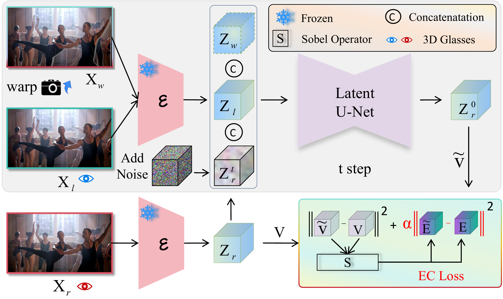

# 于松松

### Ph.D. @[Shanghai Jiao Tong University]([https://www.dlut.edu.cn](https://soai.sjtu.edu.cn/))

<i class="fas fa-envelope"></i>1: SongsongYu203@163.com(primary)

<i class="fas fa-envelope"></i>2: WeChat:yss5653686

    
    
 

## About Me

    
    
    

During my graduate studies, I was supervised by Prof. [Huchuan Lu](https://scholar.google.com/citations?user=D3nE0agAAAAJ&hl=zh-CN&oi=ao) and Prof. [Lijun Wang](https://scholar.google.com/citations?user=EfTwkXMolscC&hl=zh-CN&oi=ao) at Dalian University of Technology, where I obtained a Master's Degree. My research focused on depth estimation, audio-visual segmentation, and stereo image generation.

During my undergraduate studies, I studied subjects such as control principles, communication principles, and image processing. I was honored to be guided by professors like [Shuai Liu](https://scholar.google.com/citations?hl=zh-CN&user=IECCPKUAAAAJ&view_op=list_works), [Shuaishuai Guo](https://scholar.google.com/citations?user=D_kCy_QAAAAJ&hl=zh-CN&oi=ao), and [Ran Song](https://ieeexplore.ieee.org/author/37546859100).

Currently, my research focuses on **multimodal models** and **spatial intelligence**. I also have a keen interest in **generation models**.

I am interning at ARC LAB, Tencent PCG, with plans to enroll in a Ph.D. program in Artificial Intelligence at Shanghai Jiao Tong University in September.

## News

[2025/06/06] Today I graduated from Dalian University of Technology, and I am expected to enroll in Shanghai Jiao Tong University in September. 

[2025/02/27] My paper named "<a href="https://mono2stereo-bench.github.io/">Mono2Stereo</a>" has been accepted by CVPR 2025.

[2024/07/21] One paper named "<a href="https://dl.acm.org/doi/pdf/10.1145/3664647.3680926">SelM</a>" (<strong>Oral 3.97%</strong>) has been accepted by ACM MM 2024.

[2023/12/09] My first single-first-author paper <a href="https://ojs.aaai.org/index.php/AAAI/article/view/28506">DME</a> has been accepted by AAAI 2024! Official Debut!

[2022/09/21] I'm joining <a href="https://futureschool.dlut.edu.cn/IIAU.htm">IIAU-Lab</a> at <a href="https://www.dlut.edu.cn">DLUT</a> as postgraduate student.

[2022/06/21] I have graduated from <a href="https://www.sdu.edu.cn">Shandong University</a> today.

## Education
#### Shanghai Jiao Tong University, Shanghai, China (Now - 2029)

Ph.D. in the School of Artificial Intelligence

Research Interests: Spatial Intelligence, Embodied AI

#### Dalian University of Technology, Dalian, China (Sep. 2022 - Jun. 2025)

Postgraduate student of Engineering in Eletronic Information Engineering

Major Orientation: Depth Estimation and Audio-Visual Video Segmentation

#### Shandong University, Jinan, China (Sep. 2018 - Jul. 2022)

Bachelor of School of Control Science and Engineering

## Publications

**Mono2Stereo: A Benchmark and Empirical Study for Stereo Conversion**

**Songsong Yu**, Yuxin Chen, Zeke Xie, Yifan Wang, Lijun Wang, Zhongang Qi, YingShan, Huchuan Lu

**Accepted by** IEEE Conference on Computer Vision and Pattern Recognition(**CVPR**) 2025

[[paper]](https://mono2stereo-bench.github.io/) [[project]](https://mono2stereo-bench.github.io/)

 

**DME: Unveiling the Bias for Better Generalized Monocular Depth Estimation**

**Songsong Yu**, Yifan Wang, Yunzhi Zhuge, Lijun Wang, Huchuan Lu

**Accepted by** Association for the Advancement of Artificial Intelligence(**AAAI**) 2024

[[Paper](https://ojs.aaai.org/index.php/AAAI/article/view/28506)][[Code](https://github.com/YUsong360/DME-Unveilingthe-bias)]

**Multi-View Depth Completion with Coarse-to-Fine Networks**

**Songsong Yu†**, Haiting Wang†, Jiajun Li, Yifan Wang, Lijun Wang, Huchuan Lu (†equal contribution)

[[Paper](https://papers.ssrn.com/sol3/papers.cfm?abstract_id=4732434)]

**SelM: Selective Mechanism based Audio-Visual Segmentation**

Jiajun Li†, **Songsong Yu†**, Yifan Wang, Lijun Wang, Huchuan Lu (†equal contribution)

**Accepted by** ACM Multimedia(**ACM MM**) 2024 **Oral 3.97%**

[[Paper](https://dl.acm.org/doi/pdf/10.1145/3664647.3680926)][[Code](https://github.com/Cyyzpoi/SelM)]

## Miscellaneous
<link rel="stylesheet" href="https://cdnjs.cloudflare.com/ajax/libs/font-awesome/5.15.4/css/all.min.css">
<i class="fas fa-square fa-xs"></i>[3 yrs +] <i class="fas fa-guitar"></i>  I have a passion for Rock and folk music. My favorite music bands include Wei Xu, The Beatles, Coldplay, and Queen.

<i class="fas fa-square fa-xs"></i>[4 yrs +] <i class="fas fa-dumbbell"></i>  I enjoy running and exercising, and I achieved second place in the 3Km men's group at college.

<i class="fas fa-square fa-xs"></i>[6 yrs +] <i class="fas fa-book"></i>  Reading is one of my favorite pastimes, and I particularly admire writers such as Xiaobo Wang, Han Han, among others.

